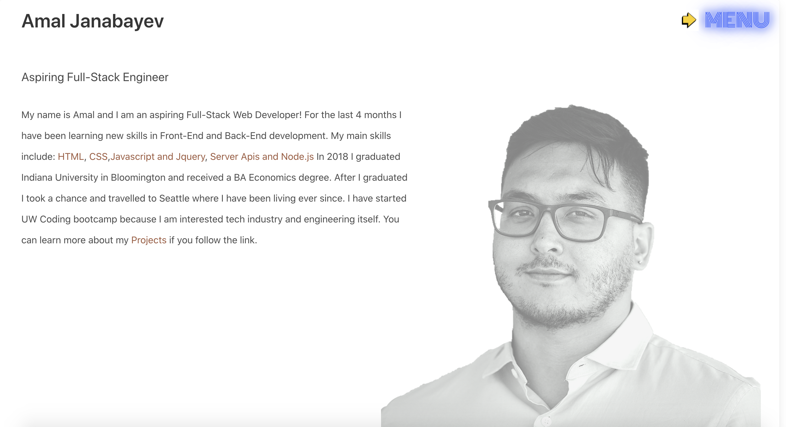

# Updated-portfolio
## Description:
This portfolio is a brief introduction into my professional life. I am an aspiring software developer currently taking a University of Washington full-stack coding bootcamp. So far I am interested in full-stack development. I absolutely love learning new technologies and implementing them in my work. I am looking forward to stepping into the world of technological advancement. Please give me a call at (314)-378-4296 or email me at amalj2426@gmail.com should you have any questions.

## Modified portfolio page. New Features
      1. Mobile responsive design
      2. Multiple event listeners(including styling properties modification)
      3. Cleaner design
      4. Headshot included

## What I would like to fix - 
      1. Smooth scrolling
      2. Connect the back end
      3. Polish styling even further
      4. Create a better color pallette

## Technologies Used:
 a) Jquery
 b) Bulma library
 c) Web Apis, event handlers
 d) Keyframes to create a flowing effect

## Credits:
  [w3schools.com](w3schools.com)
  [https://developer.mozilla.org/en-US/](https://developer.mozilla.org/en-US/)
  

## Links:
[Github repo](https://github.com/Amal31497/Updated-portfolio)
[Deployed link](https://amal31497.github.io/Updated-portfolio/)

## Screenshot:

## License: 

  ##### Copyright: Amal Janabayev

  ##### 

  ##### [License Link](http://www.apache.org/licenses/LICENSE-2.0)
